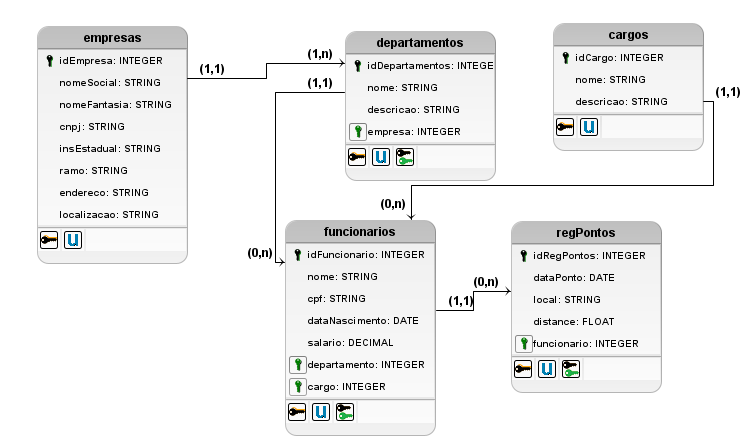

# FluffyNow - Registro de pontos

## Conceitos

Projeto FullStack para criação de um sistema web para persistência de dados relacionados a um sistema de registro de ponto de funcionários. O sistema consiste em um banco de dados (PostgreSQL) integrado via web com API (SpringBoot), que possui interface para cadastro (Angular).

## Banco de Dados

Inicialmente montou-se um modelo de negócio para a solução implementada. Levou-se em consideração um modelo de armazenamento relacional, em que algumas tabelas são compartilhadas entre as empresas, como forma de balancear a distribuição e reaproveitar dados. Segue o modelo criado: 

A implementação foi realizada em PostgreSQL, sem criação de modelo próprio em SQL, utilizando criação/integração do Hibernate para que a estruturação seja realizada. 

## Backend - API

A integração web utilizada por meio de API desenvolvida em JAVA SpringBoot. Esta API segue padrão REST para os acessos. A principio não foi configurado métodos de validação de acesso para se manter a simplicidade do projeto. 

### Métodos
Requisições para a API devem seguir os padrões:

| Método | Descrição |
|---|---|
| `GET` | Retorna informações de um ou mais registros. |
| `POST` | Utilizado para criar um novo registro. |
| `PUT` | Atualiza dados de um registro ou altera sua situação. |
| `DELETE` | Remove um registro do sistema. |

Todos as entidades a princípio possuem essas quatro operações, mesmo que a princípio não tenha sido implementados as integrações em frontend com usuário.

Testes utilizando Imnsonia geraram modelo de comunicação simplificado, justamento com conjunto de testes de acesso. 

## Frontend - Interação usuário

Os administradores do sistema devem ser capaz de cadastrar, listar e editar o conjunto de dados armazenados para a solução. Desta forma, foi criado sistema de apresentação das informações e inserções, utilizando Angular/typescript. 

Os componentes angular foram criados utilizando um padrão de inserção e listagem, para agilizar o tempo de implementação. Foram criados interfaces para os modelos de dados padrão. 

Seguem imagens da interface criada:

Nesta imagem o menu lateral é desabilitado. 

 